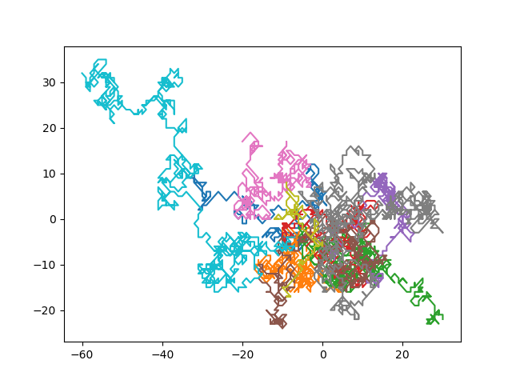
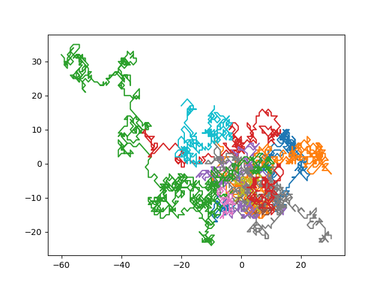

# Track Maker via Point Correlation

Here we generate a random walk datasets, uncorrelate the walks, and then try to recorrelate them. 

`python make_splatter.py` to generate the dataset

`python track_maker.py` to try to correlate them. 

